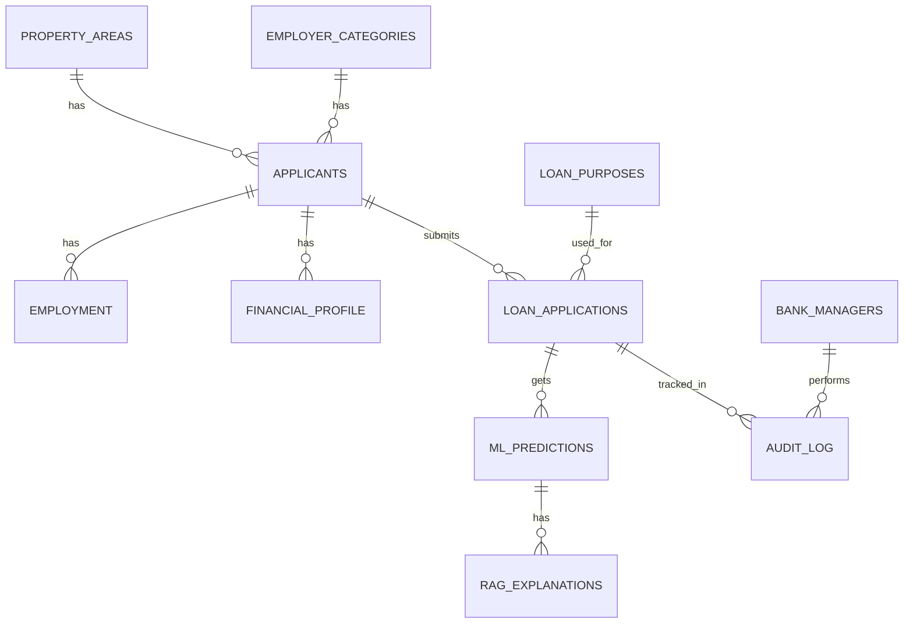

# LoanSenseAI

AI-powered loan approval and review system built for a database assignment.

## Overview

LoanSenseAI is a full-stack web app with:

- FastAPI backend
- PostgreSQL database
- Streamlit frontend
- ML-based loan prediction
- Policy-based explanation layer using ChromaDB
- Audit log and manager dashboard

The project demonstrates practical database concepts:

- ER modeling
- relational table design
- normalization
- constraints
- stored procedures
- triggers
- views
- functions
- indexes
- role-based access

## Features

- Manager login with JWT authentication
- Public loan application form
- ML approval/rejection prediction
- Policy-backed explanation for each application
- Manager dashboard for reviewing applications
- Audit log for status changes
- SQL database scripts for schema, procedures, triggers, views, and seed data

## Project Structure

- `backend/` - FastAPI API, models, controllers, SQL scripts, ML, and RAG logic
- `frontend/` - Streamlit UI
- `data/` - training dataset
- `README.md` - setup and usage guide

## Database Components

- `schema.sql` - creates tables
- `seed.sql` - inserts sample data
- `functions.sql` - reusable SQL functions
- `procedures.sql` - stored procedures
- `triggers.sql` - audit and integrity triggers
- `views.sql` - dashboard and reporting views
- `indexes.sql` - query optimization indexes
- `rbac.sql` - roles and permissions

## Setup Requirements

- Python 3.12+
- PostgreSQL
- `pip`
- Optional: Ollama if you want to experiment with LLM-based explanations later

## Installation

### 1. Clone and open the project

```powershell
git clone <repo-url>
cd loansense
```

### 2. Create and activate a virtual environment

```powershell
python -m venv venv
.\venv\Scripts\Activate.ps1
```

### 3. Install dependencies

```powershell
pip install -r requirements.txt
```

### 4. Create the PostgreSQL database

Create a database named:

```sql
loansense
```

Copy the example env file and edit it for your machine:

```powershell
copy .env.example .env
```

Then update `.env` with your local values:

```env
DATABASE_URL=postgresql://<username>:<password>@localhost:5432/loansense
SECRET_KEY=<your-secret-key>
ALGORITHM=HS256
OLLAMA_URL=http://127.0.0.1:11434/api/generate
OLLAMA_MODEL=phi3:mini
```

### 5. Load the database scripts

Run these in order:

1. `backend/db/schema.sql`
2. `backend/db/functions.sql`
3. `backend/db/procedures.sql`
4. `backend/db/triggers.sql`
5. `backend/db/views.sql`
6. `backend/db/indexes.sql`
7. `backend/db/rbac.sql`
8. `backend/db/seed.sql`

### 6. Build the policy index

```powershell
python backend/rag/ingest.py
```

## Run the App

### Terminal 1 - Backend

```powershell
cd backend
uvicorn app:app --reload --port 8000
```

### Terminal 2 - Frontend

```powershell
cd frontend
streamlit run app.py
```

Then open the Streamlit URL shown in the terminal.

## How the App Works

1. User logs in as a bank manager.
2. User submits a loan application from the frontend.
3. Backend stores the application in PostgreSQL through a stored procedure.
4. ML model predicts approval/rejection.
5. Explanation layer stores a policy-based explanation.
6. Result page shows the prediction and explanation.
7. Dashboard shows all applications.
8. Audit log shows review history.

## Default Login

Use one of these seeded accounts:

- `admin` / `password123`
- `manager1` / `password123`
- `manager2` / `password123`

## Notes for Team Members

- Always restart the backend after changing backend code or `.env`.
- If the Result page looks stale, refresh the browser after resubmitting.
- The explanation engine is currently rule-based, so it does not depend on Ollama for normal operation.
- If you want to re-enable LLM-style explanations later, Ollama can be installed separately, but it is not required for the current working version.

## Setup For Team Members

```powershell
git clone https://github.com/mohdmuqsith/loansense.git
cd loansense
copy .env.example .env
python -m venv venv
.\venv\Scripts\Activate.ps1
pip install -r requirements.txt
psql -U postgres -d loansense -f backend\db\schema.sql
psql -U postgres -d loansense -f backend\db\functions.sql
psql -U postgres -d loansense -f backend\db\procedures.sql
psql -U postgres -d loansense -f backend\db\triggers.sql
psql -U postgres -d loansense -f backend\db\views.sql
psql -U postgres -d loansense -f backend\db\indexes.sql
psql -U postgres -d loansense -f backend\db\rbac.sql
psql -U postgres -d loansense -f backend\db\seed.sql

python backend/rag/ingest.py

cd backend
uvicorn app:app --reload --port 8000
```

Open a second terminal for the frontend:

```powershell
cd frontend
streamlit run app.py
```

## Troubleshooting

- If `uvicorn app:app` fails from the project root, run it from `backend/`.
- If login fails, confirm the seed SQL was loaded and the database URL is correct.
- If the frontend is slow, make sure only one backend server is running.
- If policy explanations look wrong, rerun `python backend/rag/ingest.py` after updating the policy text.

## Suggested Demo Flow

1. Login
2. Submit a loan application
3. Open Result page
4. Show dashboard
5. Show audit log
6. Show SQL scripts and DB design in the report

## Assignment Deliverables

- Problem statement
- ERD
- Normalization
- Relational schema
- SQL scripts
- Backend explanation
- Frontend screenshots
- Demo flow
- Team details

## License

Academic project for university submission.

## ER-Diagram


